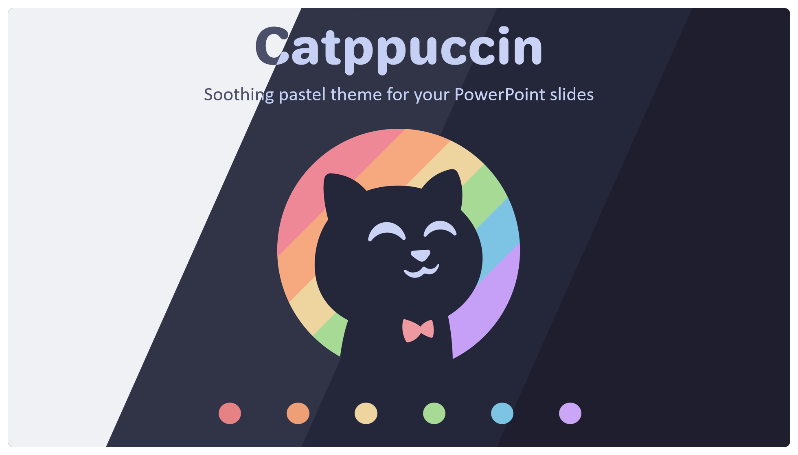

<h3 align="center">
	 
	
	Catppuccin for <a href="https://www.microsoft.com/en-ww/microsoft-365/powerpoint">Microsoft PowerPoint Slides</a>
	
</h3>

	
	
	

	

## Previews

🌻 Latte

🪴 Frappé

🌺 Macchiato

🌿 Mocha

## Usage

1. Download and install the [Jellee font](https://www.fontsquirrel.com/fonts/jellee)
2. Clone this repository locally
3. Go to the folder where PowerPoint themes are located
	- macOS: `~/Library/Group Containers/UBF8T346G9.Office/User Content/Templates`
	- Windows: `~/Documents/Custom Office Templates`
4. Copy the entire `Catppuccin` folder there

## 💝 Thanks to

- [Krypton](https://github.com/kkrypt0nn)

&nbsp;

	

	Copyright &copy; 2021-present <a href="https://github.com/catppuccin" target="_blank">Catppuccin Org</a>

	

